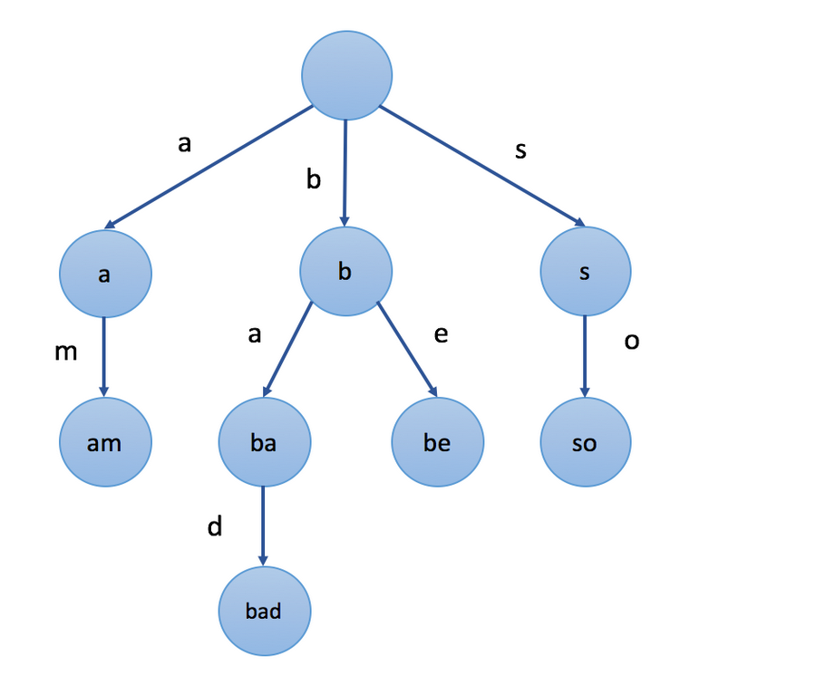

# 字典树（前缀树）

前缀树是一种多叉树结构，

前缀树的特别之处在于字符和子节点之间的对应关系。有许多不同的表示前缀树节点的方法，常用的有两种，数组和哈希表，此处着重写一下数组的形式。

- 前缀树结构

```
struct Trie {
    bool isEnd; //是否到达一个字符串的结尾
    vector<Trie *> children; // 子节点的指针数组
    Trie() {
        this->children = vector<Trie *>(26, nullptr); // 此处的字符为小写英文字母
        this->isEnd = false;
    }
};
```

- 前缀树的插入

从字典树的根开始，插入字符串。对于当前字符对应的子字节，有两种情况：

1. 子节点存在。沿着指针移动到子节点，继续处理下一个字符
2. 子节点不存在。创建一个新的子节点，记录在children数组的对应位置上，然后沿着指针移动到下一个子节点继续搜索。

当字符串遍历完毕，最后一个子节点的isEnd改为true.

```
void insert(string s){
    Tries *cur = root;
    for(auto x : s){
        if(cur->children[x - 'a'] == nullptr){
          	cur->children[x - 'a'] = new Tries();
        }
    cur = cur -> children[x - 'a'];
   	}
    cur -> isEnd = true;
}
```

- 前缀树搜索

```
// 从前缀树中查找相应的字符串
bool search(string s, Trie *root){
    Trie *cur = root;
    for(auto x : s){
        if(cur->children[x - 'a'] == nullptr)
            return false;
        cur = cur -> children[x - 'a'];
    }
    return cur->isEnd;
}
```

## 连接词问题

给你一个 不含重复 单词的字符串数组 words ，请你找出并返回 words 中的所有 连接词 。

连接词 定义为：一个完全由给定数组中的至少两个较短单词组成的字符串。

输入：words = ["cat","cats","catsdogcats","dog","dogcatsdog","hippopotamuses","rat","ratcatdogcat"]
输出：["catsdogcats","dogcatsdog","ratcatdogcat"]
解释："catsdogcats" 由 "cats", "dog" 和 "cats" 组成; 
     "dogcatsdog" 由 "dog", "cats" 和 "dog" 组成; 
     "ratcatdogcat" 由 "rat", "cat", "dog" 和 "cat" 组成。

判断一个词是否为连接词 --- 从该词的第一个字符开始，在字典树中一次搜索每个字符对应的结点，有如下可能：

- 如果一个字符对应的结点是一个单词的结尾，即找到了一个更短的单词，从该字符的后一个字符继续向下搜索更短的单词
- 如果一个字符对应的结点在字典树不存在，则当前搜索失败，回到上一个单词的结尾继续搜索

```
struct Trie{
    bool isEnd;
    vector<Trie *> children;
    Trie(){
        this -> isEnd = false;
        this -> children = vector<Trie *>(26, nullptr);
    }
};

class Solution {
    // words中不包含重复单词
    // 当按照字符串长度对words进行排序后,通过dfs能得到正确的答案
public:
    vector<string> findAllConcatenatedWordsInADict(vector<string>& words) {
        root = new Trie();
        sort(words.begin(), words.end(), [](const string &lhs,const string &rhs)
                                            {return lhs.size() < rhs.size();});

        vector<string> ans;
        for(auto &x : words){
            if(x.size() == 0) continue;
            if(dfs(x, 0)) ans.emplace_back(x);
            else insert(x);
        }
        return ans;
    }
private:
    Trie *root;

    void insert(string s){
        Trie *cur = root;
        for(auto x : s){
            if(cur->children[x - 'a'] == nullptr){
                cur->children[x - 'a'] = new Trie();
            }
            cur = cur -> children[x - 'a'];
        }
        cur -> isEnd = true;
    }

    // 
    bool dfs(const string &word, int start){
        if(word.size() == start) return true;
        Trie *cur = root;
        for(int i = start;i < word.size();++i){
            cur = cur -> children[word[i] - 'a'];
            if(!cur) return false;
            if(cur -> isEnd && dfs(word, i + 1)){
                return true;
            }
        }
        return false;
    }
};
```

