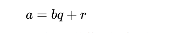
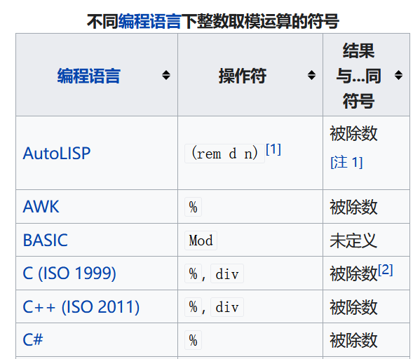
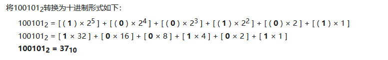
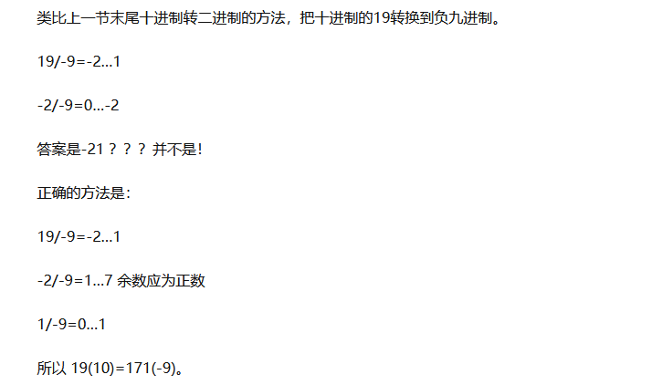

# 负数取余取模的问题

之前刷lc的时候遇到过几次，但只是当时找到了对应的解答，没有记录下来，昨天和一微软大佬讨论了一个转负数进制的问题，在此做个记录。

维基百科中：

几乎所有的计算系统中，*a* 除 *n* 得到商 *q* 和余数 *r* 均满足以下式子：

然而这样做，当余数非 0 时，余数的符号仍然是有歧义的：余数非 0 时，它的符号有两种选择，一个正、一个负。通常情况下，在数论中总是使用正余数。但在编程语言中，余数的符号取决于编程语言的类型和被除数 *a* 或除数 *n* 的符号。 标准 [Pascal](https://zh.wikipedia.org/wiki/Pascal_(程式語言)) 和 [ALGOL 68](https://zh.wikipedia.org/wiki/ALGOL_68) 总是使用 0 或正余数；另一些编程语言，如 C90 ，当除数 *a* 和除数 *n* 都是负数时，C90 标准并没有做具体的规定，而是留给编译器去定义并实现[[6\]](https://zh.wikipedia.org/wiki/模除#cite_note-C-CPP-Std-8)。 在大多数系统上 *a* mod 0 时未定义的，虽然有些系统定义它就等于 *a*。

此处截取部分资料，一下分4种情况讨论取余（模）的运算。

## 不同符号的数取模

### 正数 % 正数

30 mod  7 = 4 ...... 2

### 正数 % 负数

30 mod -7 = -4......2

### 负数 % 正数

-30 mod 7 = -4......-2

### 负数 % 负数

-30 mod -7 = 4......-2  

## 负进制的问题

普通的二进制：

负进制其各位的权值为：

1,-x,x^2,-x^3......

在负进制中，每一位上面的系数ai ,   0 <= ai <= abs(x)，即每一位上面的数都为0到进制绝对值之间的数

在负进制数中，也是根据循环取余得到结果，但与普通的取余不同，此处的余必须为正数。

