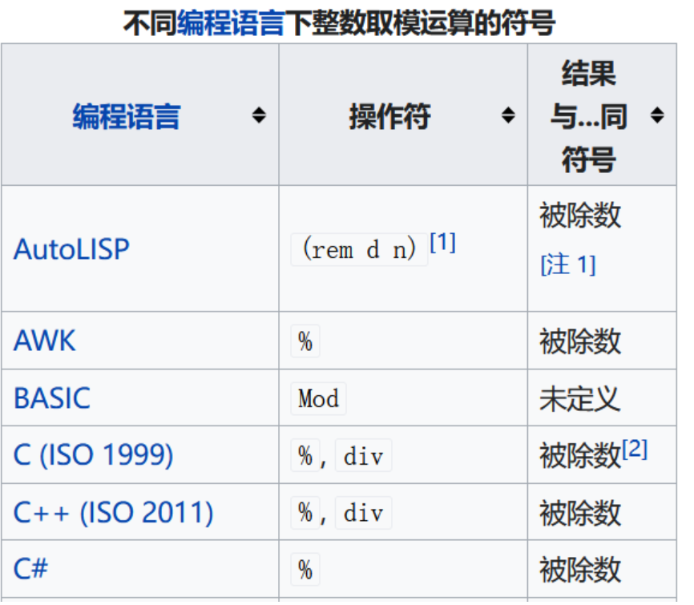

# 负2进制转换

负数进制的转换重点在于实现一个特定的取模函数，使得每次取模得到一个正数。

负数进制转换中会出现两种情况：

## 1.被除数为正数



则直接使用原有的 % 便可完成计算。

## 2.被除数为负数

%计算出的模必为负数

设被除数为n，除数（即当前的进制数）为m，商为q，余数为r

满足： n = m*q + r;

此时r为一负数，且  |r| < |m|，将上述等式转换为：n = m * (q + 1) + r - m;

此时的 r-m为新的余数，大于0，(q + 1)为新的商

```cpp
class Solution {
public:
	string baseNeg2(int n) {
        if(n == 0) return "0";
		string ans;
		while (n) {
			pair<int, int> mod = mymod(n, -2);
			ans.insert(0, to_string(mod.second));
			n = mod.first;
		}
		return ans;
	}
private:
	// 此处为特定的取模函数(不管被除数什么符号，最后的模始终为正数)
	pair<int, int> mymod(int n, int m) {
		pair<int, int> ans;
		if (n % m >= 0) {
			ans = { n / m , n % m };
		}
		else {
            // m==-2,当n为负数时,通过n%m计算所得的模为负数,需对其进行处理
			ans = { n / m + 1 , n % m - m };
		}
		return ans;
	}
};
```

